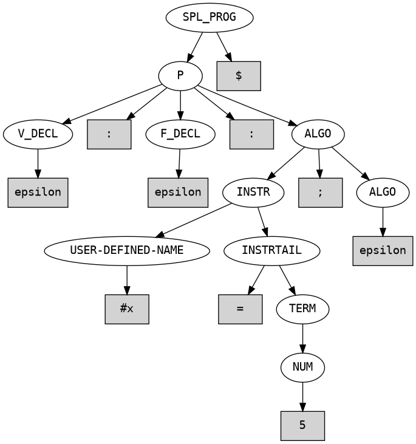
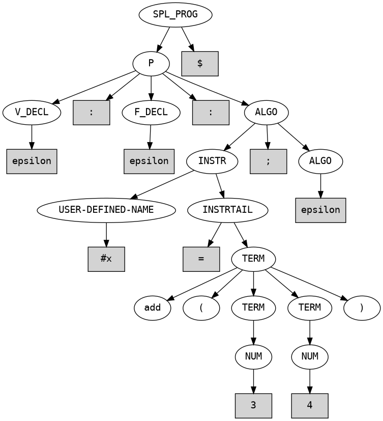
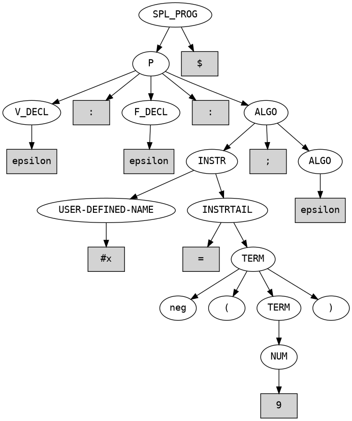
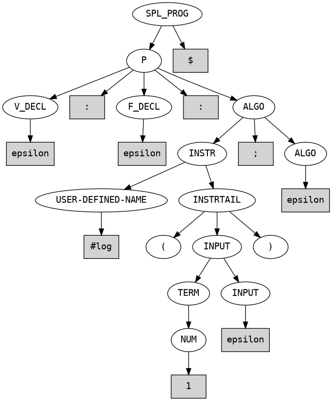
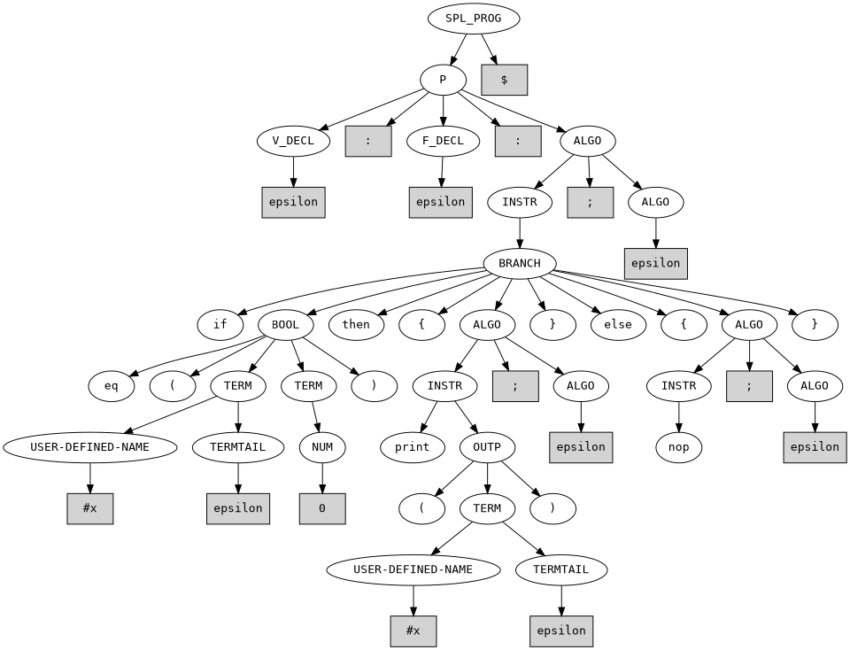
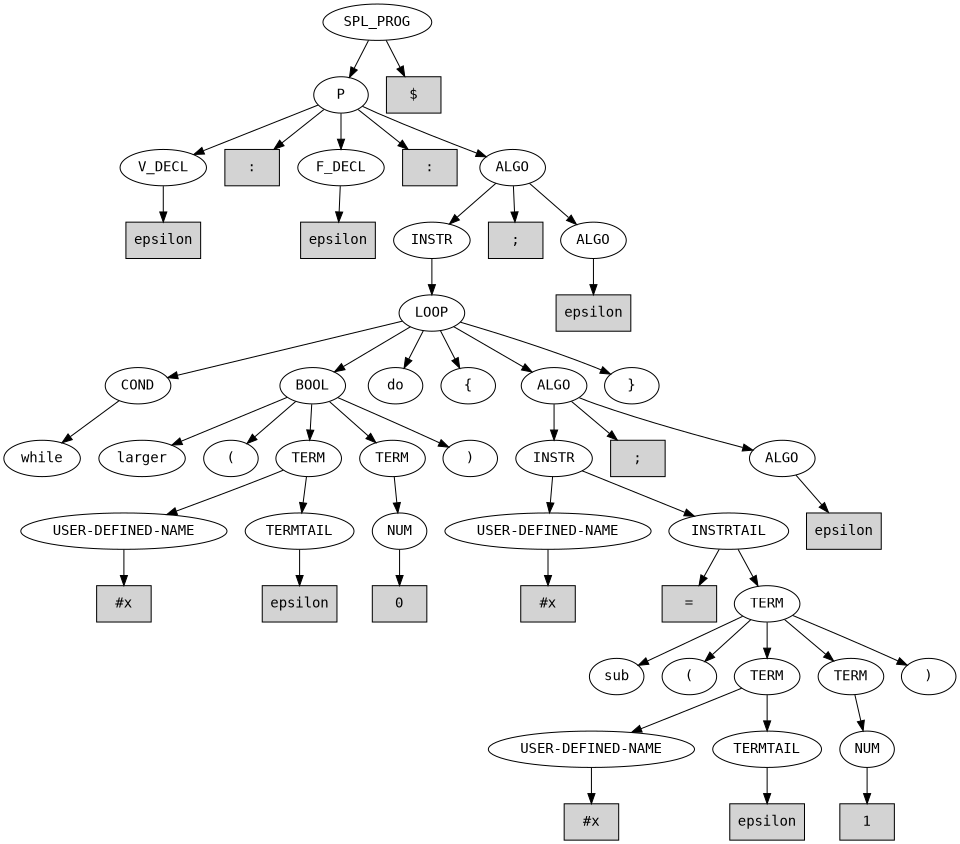
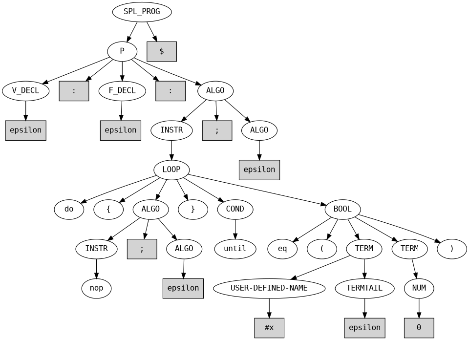
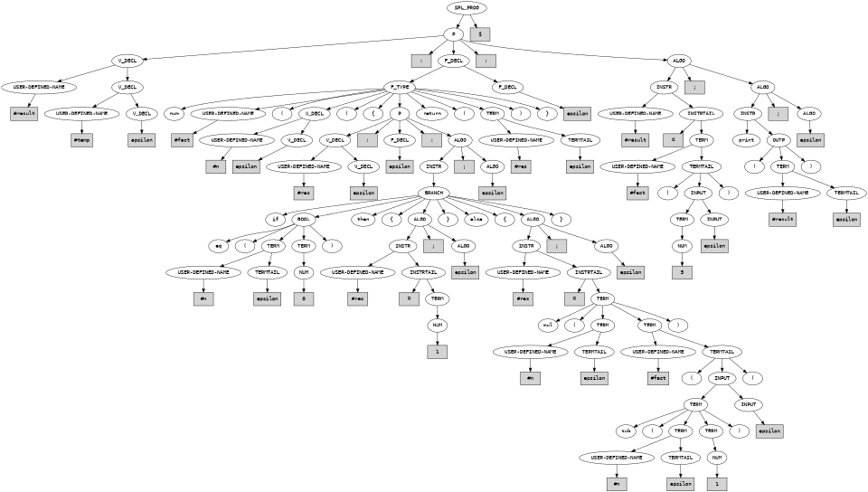
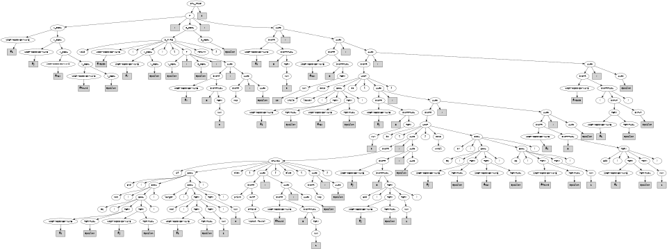
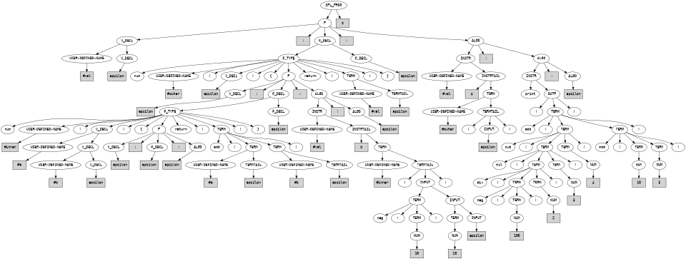

# COS341 Group Project — SPL Parser & Visualizer

A lexical analyzer, LL(1) top-down parser, and syntax tree visualizer for the Simple Programming Language (SPL).

---

## Setup & Prerequisites

### 1. Environment Setup

Create and activate a virtual environment:

```bash
python3 -m venv .venv
source .venv/bin/activate

```

### 2. Install Dependencies

Install the Python wrapper for Graphviz:

```bash
pip install graphviz

```

> **System Dependency:** Graphviz must also be installed on your operating system.
> * **Linux (Ubuntu/Debian):** `sudo apt install graphviz`
> * **macOS:** `brew install graphviz`
> 
> 

---

## Usage

### 1. Run the Parser

Parse an SPL source file to generate the AST (`tree.xml`):

```bash
python3 parser.py <filename>

```

### 2. Generate Syntax Tree Graph

Convert `tree.xml` into a rendered syntax tree image (`syntax_tree.png`):

```bash
python3 graph_gen.py

```

---

## Test Cases

### Basic Statements

**Assignment**

```text
: : #x = 5 ; $

```


**Arithmetic Addition**

```text
: : #x = add ( 3 4 ) ; $

```


**Negation**

```text
: : #x = neg ( 9 ) ; $

```


**Function Call Instruction**

```text
: : #log ( 1 ) ; $

```


**Branching (`if-then-else`)**

```text
: : if eq ( #x 0 ) then { print ( #x ) ; } else { nop ; } ; $

```


**`while` Loop**

```text
: : while larger ( #x 0 ) do { #x = sub ( #x 1 ) ; } ; $

```


**`do-until` Loop**

```text
: : do { nop ; } until eq ( #x 0 ) ; $

```


---

### Advanced Benchmarks

#### 1. Recursion & Arithmetic (`Factorial`)

Tests `num` function declarations, local variable declarations, recursive calls, and nested arithmetic expressions.

```text
#result #temp :
num #fact ( #n ) {
  #res : :
  if eq ( #n 0 ) then {
    #res = 1 ;
  } else {
    #res = mul ( #n #fact ( sub ( #n 1 ) ) ) ;
  } ;
  return ( #res )
} :
#result = #fact ( 5 ) ;
print ( #result ) ;
$

```


#### 2. Control Flow, Strings & Void Functions

Tests `void` functions, nested loops (`while` and `do-until`), multi-variable conditions (`and`, `or`, `not`), and string output.

```text
#i #j #max #found :
void #reset ( #v ) {
  : :
  #v = 0 ;
  nop ;
  return
} :
#i = 0 ;
#max = 10 ;
while lesser ( #i #max ) do {
  #j = 0 ;
  do {
    if and ( not ( eq ( #i #j ) ) larger ( mod ( #i 2 ) 0 ) ) then {
      print "match found" ;
      #found = 1 ;
    } else {
      nop ;
    } ;
    #j = add ( #j 1 ) ;
  } until or ( eq ( #j #max ) eq ( #found 1 ) ) ;
  #i = add ( #i 1 ) ;
} ;
#reset ( #i ) ;
$

```


#### 3. Nested Scopes & Prefix Expression Trees

Tests function declarations inside local scopes and deeply nested operator trees.

```text
#val :
num #outer ( ) {
  :
  num #inner ( #a #b ) {
    : :
    return ( add ( #a #b ) )
  } :
  #val = #inner ( neg ( 10 ) 20 ) ;
  return ( #val )
} :
#val = #outer ( ) ;
print ( add ( sub ( mul ( div ( neg ( 100 ) 2 ) 3 ) 4 ) mod ( 10 3 ) ) ) ;
$

```

